# Shadowsocks 笔记

by JingX
> 时间会遗忘的。

  * [前言](#--)
    + [经典思路](#----)
    + [新思路](#---)
  * [Shadowsocks大事件](#Shadowsocks大事件)
    + [一些历史事件](#------)
      - [风云突变](#----)
      - [一些话](#---)
      - [SSR之死](#ssr--)
  * [传承](#--)
  * [变数](#--)
    + [收紧的手](#----)
    + [小心翼翼](#----)
  * [新生代](#---)
      - [Surge --- 破局者](#Surge--------)
        * [题外话](#---)
      - [Shadowrocket --- 穿云箭](#Shadowrocket--------)
      - [Others](#others)
- [个人搭建指南](#------)
  * [服务器选择](#-----)
  * [服务器系统](#-----)
  * [Shadowsocks-libev](#shadowsocks-libev)
      - [obfs 混淆](#obfs---)
    + [Shadowsocks-libev安装与配置](#shadowsocks-libev-----)
  * [Shadowsocks客户端](#shadowsocks---)
    + [Windows](#windows)
      - [下载地址](#----)
      - [本地配置](#----)
    + [macos](#macos)
      - [Shadowsocks-NG](#shadowsocks-ng)
      - [ClashX](#clashx)
      - [Surge](#surge)
    + [iOS](#ios)
      - [Surge](#surge-1)
      - [Shadowrocket](#shadowrocket)
    + [Andorid](#andorid)

## 前言

翻越GFW有很多种方法，大浪淘沙，很多的方法都已经消失了，在我能够想起来的过去的，现在的，做一简单的记录：

### 经典思路

1. 修改电脑内部的host文件，通过自主指定相关网站的IP地址的方式实现，这种方式现在依然存在；
2. GFW主要攻击手段之一是DNS污染，于是便有了强制指定DNS的方式以避免IP被污染的方法，这种方法经常会结合1使用；
3. 原本用来作为一种匿名，安全，保密的VPN服务也被发掘出翻墙的潜力，其原理比较简单，选择一个没有被GFW封杀的服务器，通过该服务器将相关网站的流量转发到自己的设备，而设备与VPN服务器之间的通信并不在GFW的屏蔽范围之内，于是便达成了翻墙的目的。VPN最初的目的是用于企业服务，方便员工远程登录企业内网进行操作，主要协议有PPTP、L2TP、IPsec、IKEv2、openVPN等等；
4. GoAgent，自由门，fqrouter等一系列网络服务；

### 新思路
4. Shadowsocks类：主要包括各类Shadowsocks衍生版本，ShadowsocksR，Shadowsocks-libev等，特点是加密了通信过程中的数据；
5. 内网穿透：比较典型的是[ZeroTier](https://www.zerotier.com)，简单解释就是假装自己在国外上网，这么说的主要原因是因为当两台设备同时加入到ZeroTier的服务器之后，两台设备会拥有同一IP段内的IP地址，此时两台电脑相当于处于局域网之中，可以用iPad连接电脑远程运行MATLAB，而VPN不可以；
6. V2Ray：V2Ray 是 Project V 下的一个工具。Project V 是一个包含一系列构建特定网络环境工具的项目，而 V2Ray 属于最核心的一个。官方中介绍Project V 提供了单一的内核和多种界面操作方式。内核（V2Ray）用于实际的网络交互、路由等针对网络数据的处理，而外围的用户界面程序提供了方便直接的操作流程。不过从时间上来说，先有 V2Ray才有Project V；
7. 大杀器：奇怪的名字，似乎是一个有趣的人开发的，个人没有关注过。

## Shadowsocks
### 一些历史事件
2012年4月22日，V2EX用户clowwindy分享了一个自己自用一年多的翻墙工具：**Shadowsocks**
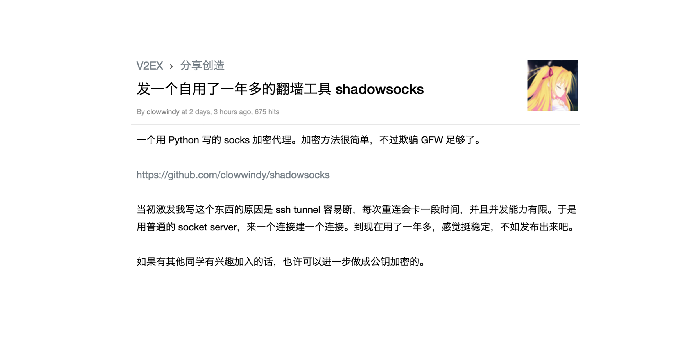
相对于以前的VPN技术，SS的一个大特点就是网络分流技术，配置文件中的网站走代理通道，之外的全部走直连通道，相较于以前所有的流量只能走代理通道，不需要代理的网站上网速度也会受到影响，着实提升了上网体验。

之后的SS的发展比较顺利，各个平台的客户端也如雨后春笋逐渐建立起来，最初的SS客户端都内置了节点信息，虽然速度略慢，但丰俭由人，普通用户安装后无需配置即可食用，有需求有技术的群体也可以使用自己的服务器。唯一遗憾的是当年的iOS上并没有网络通道的权限，要么使用ss浏览器有限翻墙，要么越狱安装客户端实现全局代理。

#### 风云突变
**2015年8月20日**，clowwindy在GitHub发出如下一段话：

>Two days ago the police came to me and wanted me to stop working on this. Today they asked me to delete all the code from GitHub. I have no choice but to obey.
>
>I hope one day I’ll live in a country where I have freedom to write any code I like without fearing.
I believe you guys will make great stuff with Network Extensions.

>Cheers!

当晚，clowwindy把他所维护的几个shadowsocks实现的代码仓库内的Issue面板全部关闭，所有帮助信息全部删除，所有的描述都改成了Something happened。另外，他还清空了该组织的membership，或者将所有成员全部转入隐私状态，不对外公开。

**2015年8月21日**传出clowwindy被请去喝茶的消息，他在 shadowsocks-windows 的 #305 issue 下回复道
>I was invited for some tea yesterday. I won’t be able to continue developing this project.

同时开启了 twitter 的隐私保护，除先前关注者外无法查看动态；
当晚clowwindy 发布了 thanks. 后的推文，证明人没事。
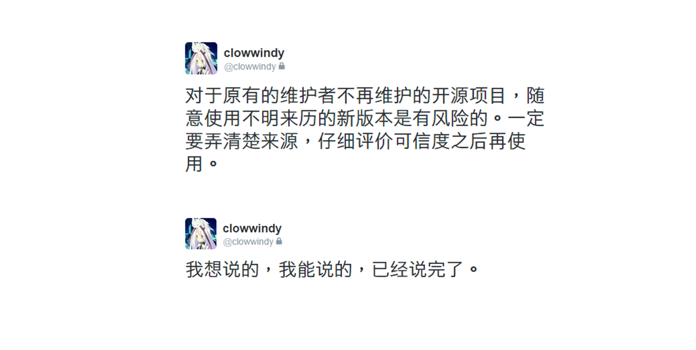
至此，SS原作者退出。

#### 一些话

后续工作并未停止，前前后后也着实发生了很多的事情，前因后果在此不计。ShadowsocksR的作者breakwa11是一个极富争议性的人，她接手了后续SS的开发工作，却违反开源协议封闭源代码，同时发布的过程中暗示自己是原作者，在[shadosocks-windows/Issue108](https://github.com/shadowsocks/shadowsocks-windows/issues/293#issuecomment-132253168)中clowwindy做出了一些回应：
>那是自然的咯。这边加了什么功能，它（SSR）马上扒过去合并了。它那边加了什么却不会贡献出来给其他人用，久而久之，不就是它那边功能更多了吗。

>一直以来我什么都没说是因为我对他还有点希望，所以得给他一点面子不是。一开始我还只是纳闷他为什么不发 pull request，过了一段时间我才明白，这个世界上也有这一类的人。不尊重 GPL 就算了，把作者名字换成自己的，还在主页上加上官方的字样。为什么我们这边反而不说官方呢？因为我希望这个项目是没有官方的，人人都是贡献者。想不到这个社会人人都围着官转，人人都巴不得当官 。

>既然他没有尊重别人劳动成果的意愿，那他那些不开源的理由想必也只是借口。说因为加了一些试验性功能会不兼容所以暂不开源。他弄了一个混淆 TCP 协议头功能，在界面上标注提升安全性，吸引用户打开，然后安装他自己的不兼容服务端。然而我分析了一下之后发现这个功能的设计就是想当然，用得多了以后反而会增加特征。如果你真有什么试验性功能，不是更应该开放出来让所有人帮你分析么，大家一起讨论么？在加密算法领域，只有经过足够多人和机构的审视的算法，才能视作是安全的，闭门造出来的怎么能用。。

>当然啦，大部分用户才不会管这些，他们不会分析你是不是真的安全，也不会做道德判断，只要他们觉得好用就行。所以可以看到，这种环境下开源其实并没有什么优势，只不过为一些人抄袭提供了便利。这种环境下最后留下来的都是这些人。

>我一直想象的那种大家一起来维护一个项目的景象始终没有出现，也没有出现的迹象。维护这个项目的过程中，遇到 @chenshaoju 这样主动分享的同学并不多。很多来汇报问题的人是以一种小白求大大解决问题，解决完就走人的方式来的，然而既不愿提供足够的信息，也不愿写一些自己尝试的过程供后人参考。互帮互助的气氛就是搞不起来。对比下国外的社区差好远。

>最适合这个民族的其实是一群小白围着大大转，大大通过小白的夸奖获得自我满足，然后小白的吃喝拉撒都包给大大解决的模式。通过这个项目我感觉我已经彻底认识到这个民族的前面为什么会有一堵墙了。没有墙哪来的大大。所以到处都是什么附件回帖可见，等级多少用户组可见，一个论坛一个大大供小白跪舔，不需要政府造墙，网民也会自发造墙。这尼玛连做个翻墙软件都要造墙，真是令人叹为观止。这是一个造了几千年墙的保守的农耕民族，缺乏对别人的基本尊重，不愿意分享，喜欢遮遮掩掩，喜欢小圈子抱团，大概这些传统是改不掉了吧。

>现在维护这些项目已经越来越让我感到无趣。我还是努力工作，好好养家，早日肉翻吧。

值得反思。

#### SSR之死

紧接着breakwa11的遭遇不论真假，同样令人胆寒

2017年7月19日，breakwa11在Telegram频道ShadowsocksR news里转发了深圳市启用SS协议检测结果，被大量用户转发，引发恐慌。

2017年7月27日，breakwa11遭到自称 "ESU.TV" 的不明身份人士人身攻击，对方宣称如果不停止开发并阻止用户讨论此事件将发布更多包含个人隐私的资料，随后breakwa11表示遭到对方人肉搜索并公开的个人资料属于完全无关人士，是自己当时随便填写的信息，为了防止对方继续伤害无关人士，breakwa11删除GitHub上的所有代码、解散相关交流群组，停止ShadowsocksR项目。

>这次的人肉事件，让我严重怀疑我自己做 SSR 是不是对的，首先不管资料对不对，从行为上看，就是有人希望我死，希望这个项目死，恨一个人能恨到如此程度。我知道我很做作，因此得罪了很多人，尤其最近公开 SS 可被检测的问题，更是让很多人义愤填膺，非要干掉我不可。尽管从我的角度看，我只是希望通过引起关注然后促进 SS 那边进行修改，这并不是希望 SS 死掉的意思，我每次提出的问题之后不是都得到了改进了吗，包括 OTA 和 AEAD，AEAD 我也是有参与设计的，你们可以问 Syrone Wong，以及 NoisyFox 证实，而且 ss-windows 有一部分也是我参与修改的。但如今，人肉的资料我也稍微看了一下，真是太令人心寒，连对方的支付宝流水都拉出来了，这样真的好吗？我并不希望因为我自己的问题而害了另一个人。我期望和那些反对我的人来一笔交易，我可以以停止开发 SSR 作为交换，删除项目及相关的东西，以后不再出现，SSR 群从此解散，账号注销，删除代码。对于我来说，这个项目不过是我用来证实自己的想法的一个东西，可有可无，制作也只是兴趣，扔掉也没有什么可惜的，反正替代品非常多，根本就不缺我这一个。你们老说我圈粉，你们真想太多了，真没这个必要。如果可以以这个换取另一人免受网络暴力，我也觉得这是值得的。相反的，如果人肉的结果仍然公开了，那就是我的行为已经救不了了，那我就可以继续开发 SSR。不过也不会太久，估计最多只多坚持一年到我毕业之前。谢谢这两年来大家的支持，这次应该是真正的和大家再见，看结果吧，今天晚上 12 点以 SSR 群解散作为标志，如果解散了那就正式和大家说一声再见

至此，SSR作者退出

##  传承

得益于clowwindy最初开源SS的决定，大量的fork使得SS依然在更新之中，从GitHub现有结果来看，各个平台（甚至是路由器）的SS仍然不断的在更新，在提交Issue，也有大功能更新，每一滴微小的力量都推动着项目的前进，只是前途在何处仍然是未知数。

## 变数

###  收紧的手

2017年7月底，中国区App Store多款VPN相关应用在无任何说明与通知的情况下，突然集体被下架，与正常下架流程不同的是，过去苹果官方下架的应用一般可以在用户的已购项目中仍然可以下载，这是对已经购买了该应用的用户权益的保障，而这次的下架直接封杀了国航所有渠道的下载，性质不同于以往，苹果给出的回应是：

> 我们已经收到要求，在中国移除一些不符合规范的 VPN App。这些 App 在其他市场的运营则不受影响 

此次下架中所谓的规范即指2017年1月工业和信息化部印发的《关于清理规范互联网网络接入服务市场的通知》，《通知》中明确表明：

> 规范的对象是未经电信主管部门批准，无国际通信业务经营资质的企业或个人，租用国际专线或VPN，私自开展跨境的电信业务经营活动。外贸企业、跨国企业因办公自用等原因，需要通过专线等方式跨境联网时，可以向依法设置国际通信出入口局的电信业务经营者租用，《通知》的相关规定不会对其正常运转造成影响。 

受此影响，大量的用户只能与开发者联系，不少开发者只能通过TestFlight对用户分发更新，但是由于TestFlight分发的app 90天后就会失效，开发者一旦弃更，用户便无法再使用该软件，此种风险也使得不少用户注册了外区的Apple ID 并重新购买应用。由于工信部要求备案，且个人无备案资格，基本上表明了此次被下架的应用无法再上架，此次的风波也受到了国际社会的广泛关注与批评，唯一算作欣慰的是，苹果在下架软件的同时，倒逼政府出台了相应的明确细则。

2017年10月，伴随着十九大的开幕，大量线路被封杀，尤其以SSR为甚，各大机场与tg群一片哀嚎，所幸大会闭幕后不少IP被解封，不清楚具体的比例。

2018年1月，以及接下来的两会期间，执行了更大规模的IP封杀，涉及范围更广，基于各种算法的翻墙方法均有涉及，SS的Issue中有人反应刚刚搭好十几分钟即被封杀。

2018年9月30日，公安部下发[通知](http://www.mps.gov.cn/n2254314/n2254409/n4904353/c6263180/content.html)

> 《公安机关互联网安全监督检查规定》已经2018年9月5日公安部部长办公会议通过，现予发布，自**2018年11月1日**起施行。 

###  小心翼翼

网传的一份联通客户端对于各个协议的识别情况：

| 软件和协议                 | 联通检测类型                                        | 访问网址     |
| -------------------------- | --------------------------------------------------- | ------------ |
| Shadowsocks                | TCP 业务                                            | 显示服务器IP |
| SS + http_simple（80端口） | 上网 (Web方式get)                                   | 显示混淆域名 |
| SSR                        | TCP 业务                                            | 显示服务器IP |
| SSR + http_simple          | 上网 (Web方式get)                                   | 显示混淆域名 |
| SSR + TLS(443)             | * 安全类网页浏览 (HTTPS VPN) 流量 <br/>* HTTPS 链接 | 显示混淆域名 |
| SSR + TLS(995)             | 安全协议的收邮件流量                                | 显示IP       |
| SSR + TLS(非443)           | * 网络连接（网页）<br/>* HTTPS 链接                 | 显示混淆域名 |
| OpenConnect                | UDP 业务                                            | 显示服务器IP |
| IPSec VPN                  | UDP 业务                                            | 显示服务器IP |
| V2Ray                      | TCP 业务                                            | 显示服务器IP |
| V2Ray + TLS                | HTTPS 网络连接                                      | 显示证书域名 |
| nghttpx + TLS              | HTTPS 网络连接                                      | 显示证书域名 |
| kcptun                     | UDP 业务                                            | 显示服务器IP |


##  新生代

所有的主流平台中，iOS 是比较特殊的，因为其权限管理相当的严格，直到 iOS 9 时代才对开发者开放VPN 相关的 Network Extension 权限，但 SS 相关软件在 iOS 上不温不火，直到 Surge 的出现。

####  Surge --- 破局者

Surge，虽然出生于 iOS 平台，但其思路打破了之前 SS 圈内的桎梏，再次促进了 SS 生态的发展。

最初的 Surge 定位于网络调试工具，作者本人写了一个 SS module 实现了 SS，也许作者本人的想法并不是翻墙，所以该 module 是一个黑箱，至今也没有支持V2Ray等新型协议。无心栽柳柳成荫，Surge 可以在 iOS 端实现全局代理，并且自开始稳定性非常好，68的售价并没有挡住人们热情的购买力，但此时的 Surge 仍然是相对小众的。

Surge 的模式非常具有开创性：

  1. 以文本 config 设置软件，非常的 linux；
  2. 因为 Surge 定位为网络调试工具，因为配置文件中可以单独设置面对某网址或某IP时，网络对其的响应，主要包含 proxy，direct，reject 3种核心模式，同时，Surge 可以观测到网络的连接情况，实现重发等操作，实现抓包。于是，一个网络调试软件，得益于优异的思路，经由网友们的一番探索，使其可以指定代理地址，屏蔽广告，解析视频地址，抓取网络流量，堪称完美。

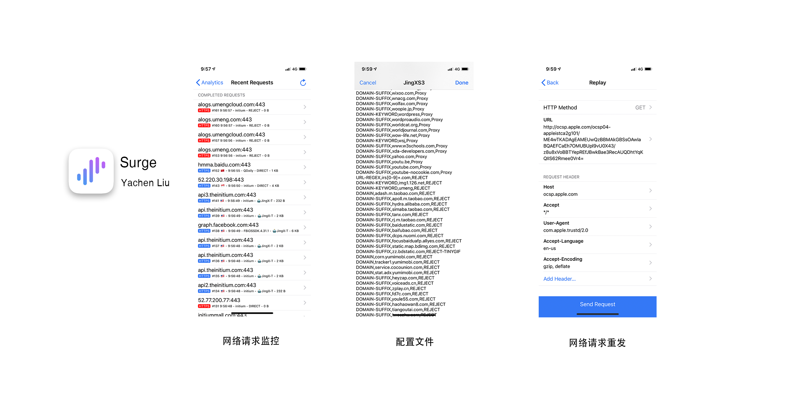

##### 题外话

Surge 固然好，但是其开发者 Yachen Liu 却着实是一个富有争议的人，整理的 Surge 时间线如下：

- 2015年10月26日 Surge 以68元的售价上架 App Store；

- 2015年11月29日 Yachen Liu 自称被喝茶（注：无法被证实）；

- 2015 年 12 月 4 日 ，Surge App Store **全区下架**，之后又以648元的高价短期上线，作者解释为方便已购买用户更新；

- 2016 年 3 月，Surge iOS 2.0 版本发布，承诺648元**永不降价**，同时启用反盗版策略，180天内仅能激活十台设备；

- 2016 年 8 月，Surge Mac 2.0 版本发布，iOS 版本价格调整为 328元，作者解释648元为 Mac 与iOS双版本价格，价格调整是售卖策略发生变化；

- 2017年5月，Surge限时8折；

- 2018 年 1 月，iOS Surge 3发布，根据老用户购买时间提供免费升级和优惠升级，同时提升反盗版策略，仅能激活3台设备；

- 2018年10月，作者发推表示

  > 计划给 Surge iOS 加一个新功能，可以选择将自己的授权与 iCloud 账号绑定，绑定后最多可激活 6 个设备，但是仅可以在自己的 iCloud 登录的设备上使用。 

作者确实是网络技术大牛，截至目前，Surge 仍然是iOS端最优秀的 SS 客户端，但是其营销策略极富争议性，喝茶事件至今无法证实，且之后全区下架客户端也毫无道理，之后长期上架 App Store 也不能很好的自圆其说，因此被称为喝茶营销。

作者对高价的解释是 Surge 是面向国际的网络调试设备，主要竞品是老牌应用 Charles，但是这几年的发展下来，调试功能这种核心并没有实质的长进，反盗版能力，UI设计倒是提升不少，口嫌体直般升级了 SS 的最新版本，却死活不肯添加 V2ray 等新协议，面向国际的软件，核心用户却是国内用户，可以说是相当的傲娇。

#### Shadowrocket --- 穿云箭

Surge 下架上架来回折腾的时候，不少开发者也看到了机遇，Shadowrocket 便是当时的 Surge 追随者，最初上架性能虽然不佳，但是6元的售价并且兼容Surge规则还是吸引了不少人下载，一时间风头无两，被称为小火箭。

小火箭的作者 Guangming Li 似乎是个奶爸，最初小火箭比较简陋，随着快速的迭代更新，小火箭功能逐渐完善起来，稳定性也提高了不少，在摆脱 Surge 的同时，小火箭也开发出了不少让人眼前一亮的新功能。

与Surge不同，小火箭的初衷就是为了翻墙，所以作者直接就内置了各种翻墙协议，通过UI界面非常容易添加和修改，作者也针对国内的环境开发出了场景模式，按需求连接，服务器订阅等模式，同时作者在[Telegram](https://t.me/ShadowrocketApp)上创建了群组，用户之间的交流以及开发者的反馈速度很快。

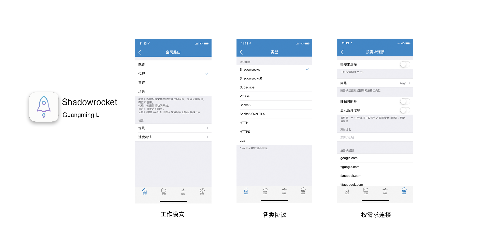

现在的小火箭可以说已经尽善尽美了，作者更新的频率大大降低，但是仅仅18元的售价显得非常的亲民。

#### Others

iOS上还有A.BIG.T，Potatso等VPN软件，16年17年与小火箭战的难舍难分，无奈后劲不足，现在大概是明日黄花了。

[Quantumult](https://itunes.apple.com/us/app/quantumult/id1252015438#?platform=iphone)是新近崛起的一款代理软件，$4.99 的售价可以实现 Surge 的大部分功能，支持多种协议，相较于小火箭又多出了抓包功能，测试规则更方便，同时，Quantumult 扩展了规则中的屏蔽性能，使得屏蔽广告更有针对性。

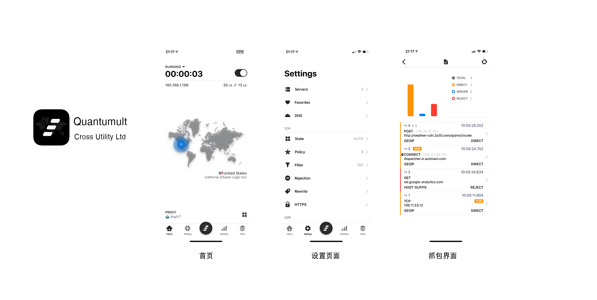

# 个人搭建指南

## 服务器选择

一般来说，VPS的虚拟化技术分为 OpenVZ 与 KVM 架构，从各种资源以及 SS 服务支持上，建议选择 KVM 架构的机器，以下所有的说明都是基于搬瓦工 KVM 建构的机器。

## 服务器系统

服务器建议安装带有BBR技术的Linux系统，TCP BBR 拥塞控制算法由 Google 开发，并提交到了 Linux 内核，从 4.9 开始，Linux 内核已经用上了该算法。根据以往的传统，Google 总是先在自家的生产环境上线运用后，才会将代码开源，此次也不例外。根据实地测试，在部署了最新版内核并开启了 TCP BBR 的机器上，网速甚至可以提升好几个数量级。

搬瓦工的机器可以在控制面板 ---> install new os ---> centos-7-x86_64-bbr，快速更换系统，注意备份服务器上的数据。

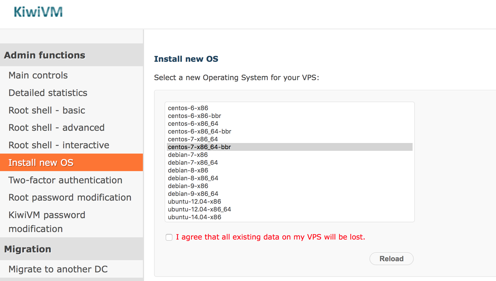

## Shadowsocks-libev

随着技术发展，SS与墙之间的交锋也是一次比一次激烈，据传说，即使是SS的256位加密，运营商可以做到解密，监视SS使用者的上网流量，真实性未知，但小心点总不会错。

目前有4个衍生版本的SS:

1. Shadowsocks-go: 二进制编译, 轻量, 快速
2. Shadowsocks-python: 无功无过，也是最原始的版本，近年来更新速度略慢
3. Shadowsocks-libev: 一直处于更新之中，最大的特点是支持obfs混淆
4. ShadowsocksR: 从作者到产品都极负争议性, obfs混淆模式开创者, 但是前一段时间SSR服务器普遍遭到GFW的封杀. 

现阶段为了能在安全与速度之间取得平衡，我个人更加推荐使用 Shadowsocks-libev + obfs混淆。

#### obfs 混淆

obfs 混淆最大的作用是对 SS 流量进行伪装, 在不添加obfs的情况下, 运营商服务器通过的流量为未知的加密流量, 据说 GFW 已经有一定的包检测的能力, 仅仅加密流量具有一定的风险, 添加 obfs http 模式之后, 通过运营商的流量会被识别为设定好的网址的流量, 假设你设定的是 bing, 那么你的 SS 流量会被判别为你当前正在访问 bing, 减少了被封杀的可能性，**tls模式安全性高于http模式**。

之前流量不是无限的时代, 因为只有运营商的 APP 可以无限使用流量, 比如什么天翼视讯, 利用 obfs 混淆, 可以将你的手机流量伪装为天翼视讯的流量, 从而达到无限使用使用流量, 这种操作太骚, 实测可以成功, 不过还是低调的好.

### Shadowsocks-libev安装与配置

安装图省心推荐秋水逸冰的[一键安装脚本](https://teddysun.com/357.html)

1. 使用root用户ssh登录

   ```shell
   wget --no-check-certificate -O shadowsocks-all.sh https://raw.githubusercontent.com/teddysun/shadowsocks_install/master/shadowsocks-all.sh
   chmod +x shadowsocks-all.sh
   ./shadowsocks-all.sh 2>&1 | tee shadowsocks-all.log
   ```

2. 跟随提示选择相对应的模式即可

   1. 加密方式推荐 **chacha20-itef-poly1305**, 
   2. 端口可以尽量设置高一点,避免443, 1080等常用端口, 
   3. **安装 simple-obfs , 选择 http 模式**

   安装成功后会有如下提示:

   ```shell
   Congratulations, your_shadowsocks_version install completed!
   Your Server IP        :your_server_ip
   Your Server Port      :your_server_port
   Your Password         :your_password
   Your Encryption Method:your_encryption_method
   
   Your QR Code: (For Shadowsocks Windows, OSX, Android and iOS clients)
    ss://your_encryption_method:your_password@your_server_ip:your_server_port
   Your QR Code has been saved as a PNG file path:
    your_path.png
   
   Welcome to visit:https://teddysun.com/486.html
   Enjoy it!
   ```

   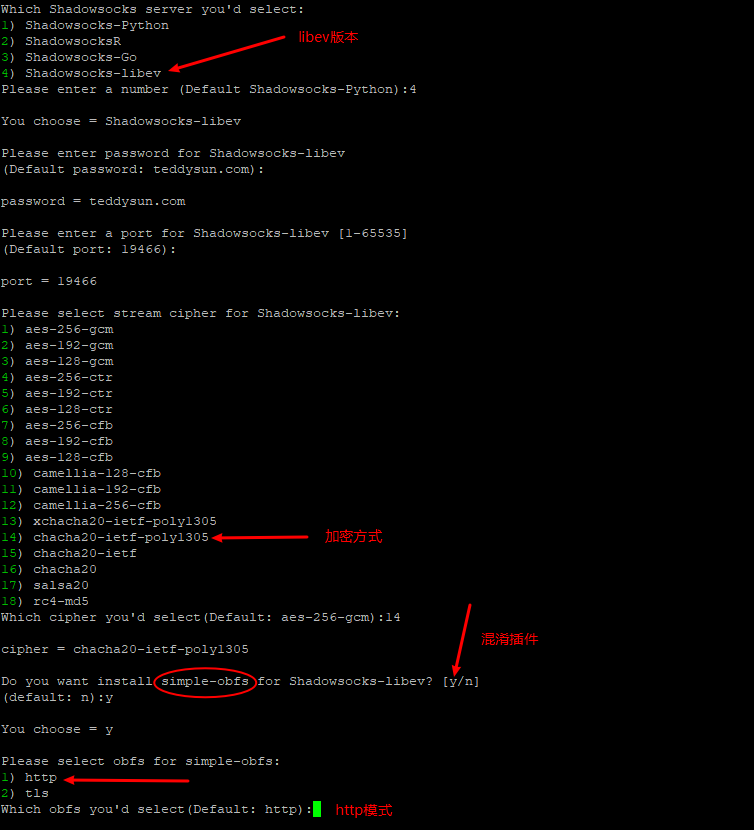

3. 卸载

   使用root用户登录

   ```shell
   ./shadowsocks-all.sh uninstall
   ```

4. 常用命令

   ```shell
   启动：/etc/init.d/shadowsocks-libev start
   停止：/etc/init.d/shadowsocks-libev stop
   重启：/etc/init.d/shadowsocks-libev restart
   查看状态：/etc/init.d/shadowsocks-libev status
   ```

## Shadowsocks客户端

SS 客户端已经全平台覆盖了, Github 上有专门的开源客户端项目.

### Windows

#### 下载地址

- [Win SS客户端下载地址](https://github.com/shadowsocks/shadowsocks-windows/releases)
- [SS obfs-local插件下载地址](https://github.com/shadowsocks/simple-obfs/releases)

#### 本地配置

服务器端已将安装了 obfs, 本地端直接下载obfs-local插件, 解压后**将插件 obfs-local 与Shdowsocks.exe 同一路径下**即可.

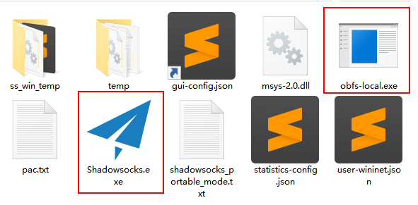

obfs可以直接在SS的服务器编辑页面修改参数

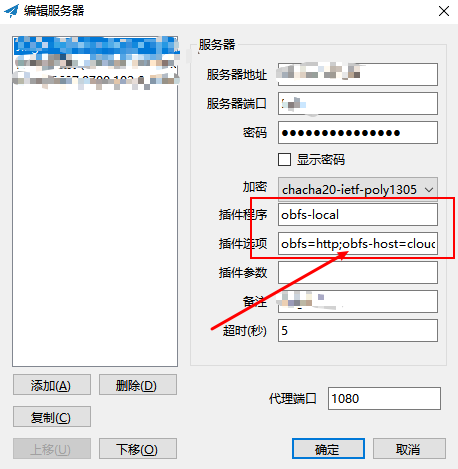

插件选项为 **obfs=http;obfs-host=www.bing.com**, 实际上可以将 www.bing.com 更换为任意的一个网址, 只要不是被GFW封杀的就可以, 推荐像腾讯视频, 优酷, bing这种流量较大的网站, ~~如果填写是Google或者YouTube, 活着不好么......~~

### macos

~~macos上的ss客户端目前似乎还是不支持obfs混淆.~~
2018/10/06更新
#### Shadowsocks-NG

GitHub上存在好几种Mac客户端，使用最广的是Shadowsocks-NG，目前的版本中已经支持obfs混淆，并且已经直接集成于客户端之中，无需额外下载，按照windows的设置填写参数即可。
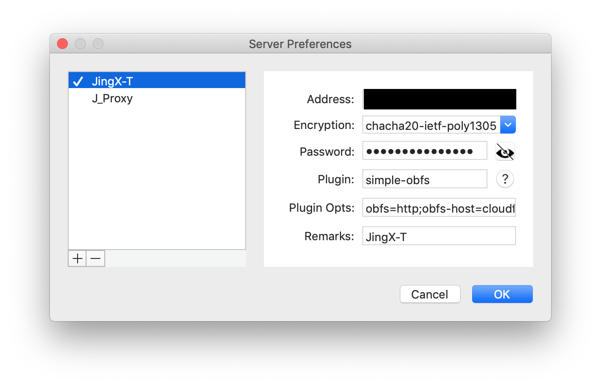

- [Shadowsocks-NG 下载地址](https://github.com/shadowsocks/ShadowsocksX-NG/releases)

#### ClashX

最近出现了一个新的类Surge软件，ClashX，目前还在快速迭代期之中，兼容 Surge 的 config 文件，基本上对其稍作修改便可以导入 ClashX 中使用。可以去官方[ Telegram 群](t.me/clash_discuss)参与讨论

类Surge软件的核心都在于config文件，在SS网络分流的基础上，对不同的流量产生不同的行为，可以实现指定网址代理，广告屏蔽等效果，自由度更高。

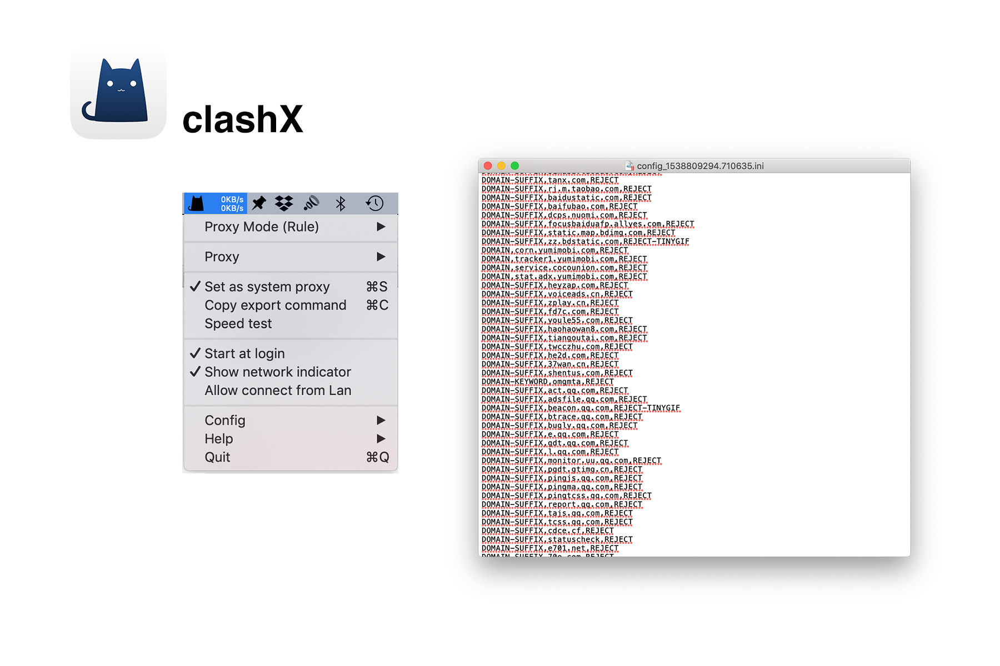

- [ClashX 下载地址](https://github.com/yichengchen/clashX/releases)

#### Surge

支持obfs混淆，在3.0版本中加入了全新的rule-set模式，config的管理从本地可以完全移至云端，不同的rule-set对应不同的应用规则，更容易管理，只可惜没钱截图😂

### iOS

iOS上推荐的客户端为 Shadowrocket 与 Surge, 首推  Shadowrocket, 因为便宜够用, 唯一遗憾的是国区下架了, 只能用非国区的 Apple ID 购买与下载, Surge3 目前可以在国区下载, 虽然 Surge 是配置文件类开创者, UI 更好看, 功能更强大,颇高的上手难度与328的价格会吓退不少人，但一句话，Surge 贵在稳定。

两款客户端均支持 obfs, Surge 2 仅支持 http 模式, Surge 3 支持 tls  与 http 两种模式; shadowrocket 支持 http 与 tls 两种模式

2018年10月8日更新：Quantumult 最近热度也上来了，在小火箭与 Quantumult 任选其一既可。

#### Surge

Surge 在编辑服务器的 Advance 设置中可以配置混淆

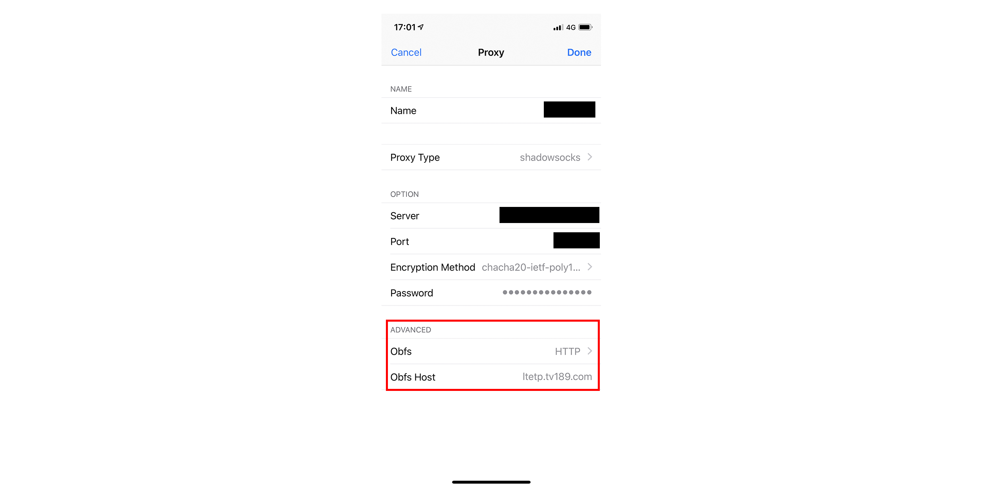

#### Shadowrocket

shadowrocket在服务器的编辑页面中即可设置混淆

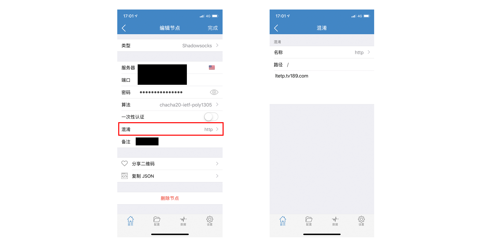

### Andorid

推荐在Google Play上下载Shadowsocks app, 同时下载obfs插件, 开发者均为 Max Lv. 

也可以前往 [Shadowsocks-Andorid](https://github.com/shadowsocks/shadowsocks-android/releases) 的 GitHub 仓库下载。

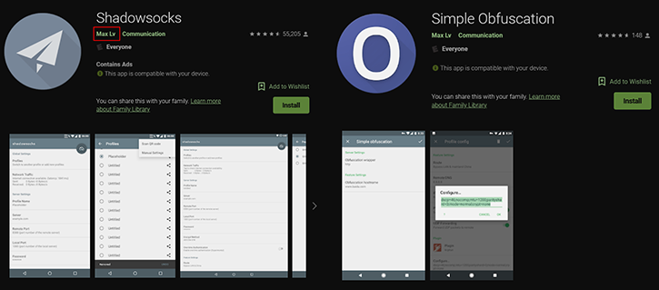

